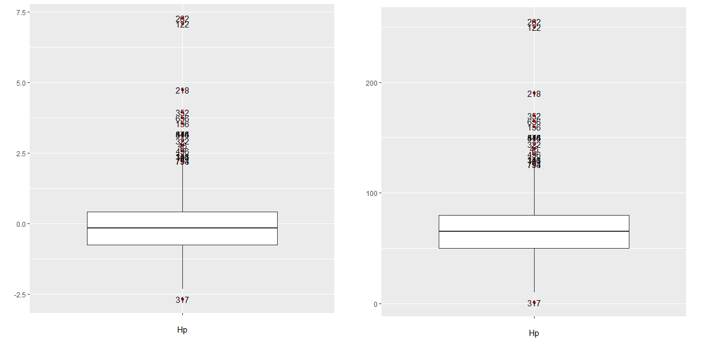
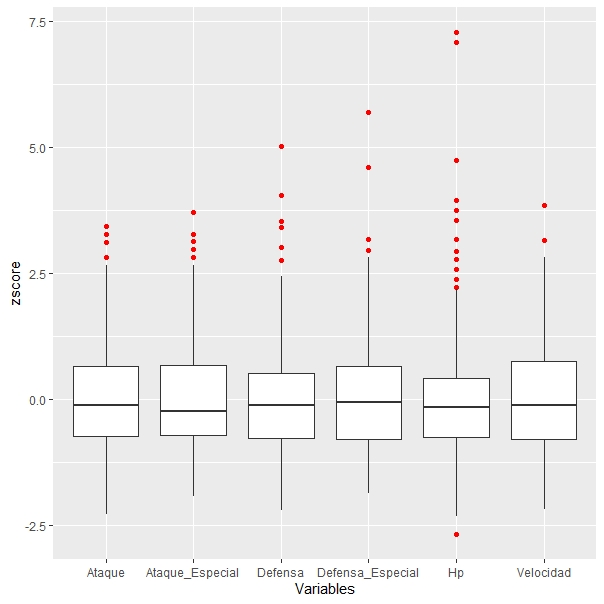
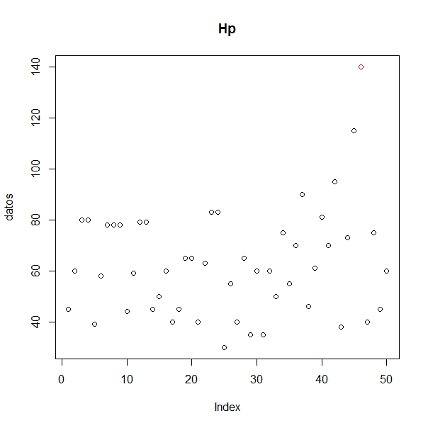
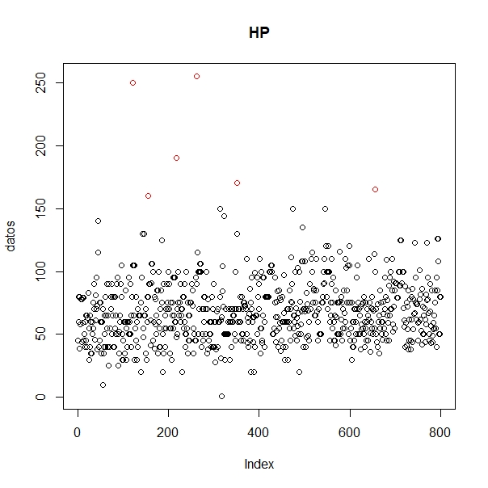
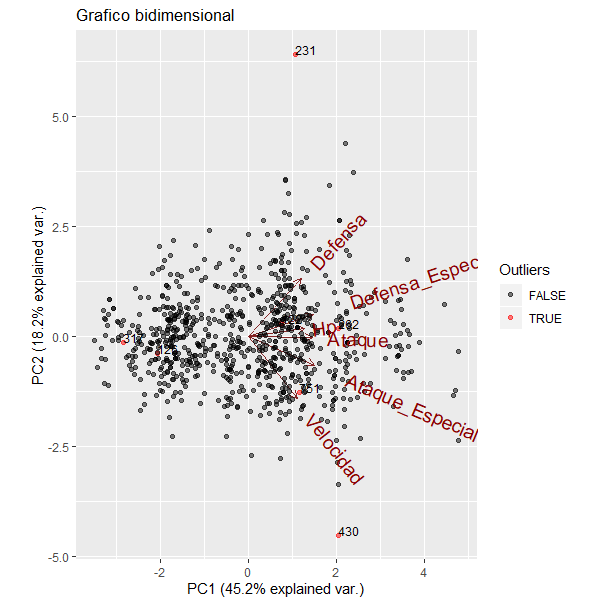
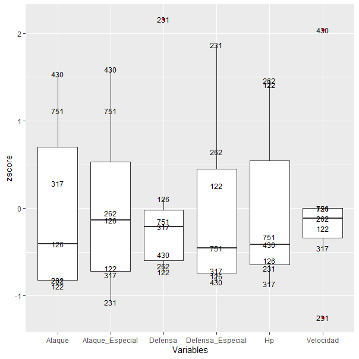
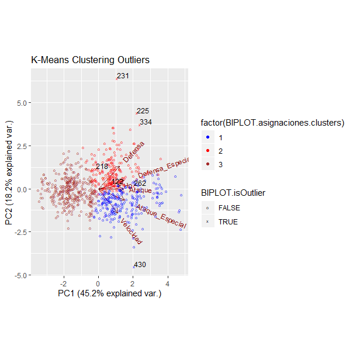
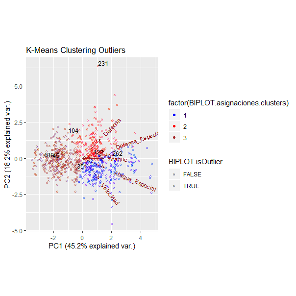

\begin{titlepage}
	
	\begin{center}
		\vspace*{-1in}
		\vspace*{0.25in}
		\vspace*{0.6in}
		\begin{figure}[htb]
			\begin{center}
				\includegraphics[width=12cm]{./images/logo}
			\end{center}
		\end{figure}
		\huge
			Master en Ciencia de Datos e Ingenieria de Computadores\\
		\vspace*{0.3in}
		\begin{Huge}
			\textbf{Detección de Anomalías} \\
		\end{Huge}
		\vspace*{0.5in}
		\begin{huge}
			Autor:\\
			Nicolás Delgado Guerrero
		\end{huge}
	\end{center}
	
\end{titlepage}

\tableofcontents

\newpage


# 1. Resumen.

En el presente trabajo haremos uso de un conjunto de datos que reune información acerca de todos los Pokemon de la famosa saga de videojuegos. Buscaremos anomalías en los stats de los mismos para encontrar Pokemon interesantes para jugar a nivel competitivo. Los stats son los puntos de poder que tiene el Pokemon en distintas características como pueden ser el ataque o la defensa. 

Primero analizaremos los outliers univariantes. Nos centraremos en técnicas estadísticas, método IQR y tests estadísticos. Para ello deberemos suponer que la distribución de cada variable es normal aunque también podemos aplicar los métodos para variables unimodales.

Veremos que hay outliers que presentan valores extraños en la combinación de sus variables, para encontrarlos haremos un análisis de outliers multivariante. Usaremos técnicas paramétricas basadas en la distancia de Mahalanobis y no paramétricas, LOF y Clustering.

\newpage

# 2. Análisis Exploratorio de Datos.

Vamos a cargar el Dataset y ver que tipo de datos nos encontramos.

```{r}
pokemon =read.csv("pokemon-pokemon-with-stats-QueryResult.csv")
str(pokemon)
```

Vemos que tenemos 800 observaciones y un total de 13 variables. La primera variable o columna indica el número al que pertenece el Pokemon en la Pokedex nacional, se observa que no coincide con el número de la observación ya que hay algunas transformaciones en ciertos Pokemon que indican sus stats pero no se consideran una especie nueva, como el caso de MegaVenasaur. La segunda columna contiene un string con el nombre del pokemon. La columna c y d nos informa el tipo que tiene cada pokemon, en columna d habra un NA si el pokemon solo tiene un tipo. Desde la columna e hasta la k tenemos: suma de todos los stats, Hp o puntos de vida, ataque, defensa, ataque especial, defensa especial y velocidad respectivamente. La columna l nos dice a que generación pertenece el pokemon y la m si es legendario o no. 

Lo primero que haremos será cambiar el nombre de las variables para acceder a ellas de forma más intuitiva. Para ello haremos uso de la biblioteca dplyr.

```{r}
library(dplyr)
pokemon = pokemon %>% rename(Num_Pokedex = column_a, Nom_Pokemon = column_b,
                   Tipo1 = column_c, Tipo2 = column_d, Sum_Stats = column_e,
                   Hp = column_f,  Ataque = column_g, Defensa = column_h,
                   Ataque_Especial = column_i, Defensa_Especial = column_j,
                   Velocidad = column_k, Generacion = column_l,
                   Legendario = column_m)
head(pokemon)
```

Para nuestro estudio solo vamos a hacer uso de las variables numéricas, es decir los stats. Vamos a crear dos conjunto de datos, ambos solo con el nombre del pokemon y sus stats, una de ellas normalizada y la otra sin normalizar los datos.

```{r}
pokemon = pokemon[c(2,6:11)]
pokemon_normalizado = data.frame(pokemon$Nom_Pokemon,scale(pokemon[,2:7]))
```

Una hipótesis muy importante a la hora de trabajar con los datos es la normalidad. Si los datos se distribuyen como una variable aleatoria normal podremos hacer uso de muchas tecnicas estadísticas y podremos conocer más afondo el comportamiento de la variable.

Para ello usaremos el test de shapiro donde la hipótesis nula y alternativa serían las siguientes:
$$
\left\{
  \begin{aligned}
    H_0:X\rightarrow \mathcal{N}(\mu,\sigma^2)\\
    H_1:X\nrightarrow \mathcal{N}(\mu,\sigma^2)
  \end{aligned}
\right.
$$ 

```{r}
Tests=lapply(pokemon[,2:7], shapiro.test)
for (i in 2:7){
  cat(names(pokemon)[i],"p-valor test shapiro: ",Tests[[i-1]]$p.value,"\n")
}
```

En todos los casos rechazamos la hipótesis nula. Veamos como se comporta la función de densidad mediante unos histrogramas.


```{r,fig.align='center',fig.height=3,fig.width=9}
par(mfrow=c(1,3))
for (i in 2:7) {
  hist(pokemon[[i]],xlab = names(pokemon)[i],main = "",breaks = 50,freq=FALSE)
  curve(dnorm(x, mean=mean(pokemon[[i]]), sd=sd(pokemon[[i]])), add=TRUE, col="red")
}
```

Observamos que la distribución no es normal pero por lo menos no presentan varias modas. Al ser unimodal podremos usar distintas tecnicas a lo largo del trabajo, aunque eso sí, no serán tan significantes como lo serían bajo hipótesis de normalidad.

\newpage

# 3. Outliers Univariantes IQR.

En este apartado usaremos tecnicas estadísticas para el computo de outliers con respecto una única característica, para ello haremos uso del método IQR el cual se basa en el cálculo del rango intercuartílico. Una hipótesis a resaltar para que estas técnicas tengan eficacia, es la normalidad de los datos. Podemos reducir restricciones a comprobar que los datos no presentan varias modas.

En los histogramas realizados en \textbf{2. Análisis Exploratorio de Datos} podemos observar que la mayor parte de área que recoge función de densidad, se localiza en una zona concreta y no presentan varios apuntamientos, por lo que concretamos que las variables son unimodales.

## 3.1 Trabajando con una columna.

En este parte trabajaremos solo con una variable, podemos seleccionar por ejemplo la variable que recoge los puntos de vida, Hp.

```{r}
indice_columna = 2
```

Primero calcularemos los cuartiles uno, dos y tres y por último la distancia intercuartílica.

```{r}
cuartil_primero = quantile(pokemon[,indice_columna], probs = 0.25)
cuartil_primero

cuartil_segundo = quantile(pokemon[,indice_columna], probs = 0.5)
cuartil_segundo

cuartil_tercero = quantile(pokemon[,indice_columna], probs = 0.75)
cuartil_tercero

iqr = IQR(pokemon[,indice_columna])
iqr
```

Mediante los cuartíles y el rango intercuartílico podemos calcular los valores que particionan el rango de los datos para detectar los outliers.

```{r}
extremo_superior_outlier_normal  = cuartil_tercero[[1]] + 1.5*iqr
extremo_superior_outlier_normal

extremo_inferior_outlier_normal  = cuartil_primero[[1]] - 1.5*iqr
extremo_inferior_outlier_normal

extremo_superior_outlier_extremo = cuartil_tercero[[1]] + 3*iqr
extremo_superior_outlier_extremo

extremo_inferior_outlier_extremo = cuartil_primero[[1]] - 3*iqr
extremo_inferior_outlier_extremo
```

A priori ya podemos decir que no hay outliers extremos inferiores porque la variable Hp es estrictamente positiva.

Ahora calcularemos los vectores lógicos que nos indican con un True el pokemon que presenta un outlier en sus puntos de vida.

```{r}
vector_es_outlier_normal = pokemon[,indice_columna] > extremo_superior_outlier_normal |
  pokemon[,indice_columna] < extremo_inferior_outlier_normal

vector_es_outlier_extremo = pokemon[,indice_columna] > extremo_superior_outlier_extremo |
  pokemon[,indice_columna] < extremo_inferior_outlier_extremo
```


Con estos dos vectores podemos acceder a las posiciones en la que se encuentran los outliers y ver de que pokemon se tratan. Primero calcularemos un dataframe que contenga todos los outliers normales. Guardaremos en un vector el nombre y los valores de cada pokemon que presenta un outlier.

```{r}
claves_outliers_normales = which(vector_es_outlier_normal == TRUE)
claves_outliers_normales

data_frame_outliers_normales = pokemon[claves_outliers_normales,]
head(data_frame_outliers_normales)

nombres_outliers_normales =as.character(data_frame_outliers_normales$Nom_Pokemon)

valores_outliers_normales = pokemon[claves_outliers_normales,indice_columna]
```

Hacemos lo mismo para los outliers extremos.

```{r}
claves_outliers_extremos = which(vector_es_outlier_extremo == TRUE)
claves_outliers_extremos

data_frame_outliers_extremos = pokemon[claves_outliers_extremos,]
data_frame_outliers_extremos

nombres_outliers_extremos =as.character(data_frame_outliers_extremos$Nom_Pokemon)

valores_outliers_extremos = pokemon[claves_outliers_extremos,indice_columna]
```

Veamos la desviación de los outliers con respecto a la media de la columna. Para ello usaremos las claves de los outliers en el dataset con los datos normalizados previamente.

```{r}
valores_normalizados_outliers_normales = pokemon_normalizado[claves_outliers_normales,]$Hp
valores_normalizados_outliers_normales

valores_normalizados_outliers_extremos = pokemon_normalizado[claves_outliers_extremos,]$Hp
valores_normalizados_outliers_extremos
```

Veamos gráficamente los resultados obtenidos. Haremos uso de las funciones dadas en la clase de prácticas. Vamos a hacer un plot que en el eje x recoja la observaciones y el eje y el valor de sus puntos de vida, con ello podemos observar los outliers pintados en color rojo.

```{r,eval=FALSE}
windows()
MiPlot_Univariate_Outliers(pokemon[,indice_columna],claves_outliers_normales,"Hp")
```

```{r pressure, echo=FALSE, fig.cap="", out.width = '70%'}
knitr::include_graphics("1.jpeg")
```

Podemos usar los diagramas de cajas para observar los outliers. Lo hacemos para los valores normalizados y sin normalizar para ver que la distribución no cambia.

```{r,eval=FALSE}
windows()
MiBoxPlot_IQR_Univariate_Outliers(pokemon,indice_columna,coef = 1.5)
windows()
MiBoxPlot_IQR_Univariate_Outliers(pokemon_normalizado,indice_columna,coef = 1.5)
```

```{r pressure1, echo=FALSE, fig.cap="", out.width = '85%'}

```

## 3.2 Trabajando con varias columnas simultaneamente.

```{r,echo=FALSE}
vector_es_outlier_IQR = function (datos, indice.de.columna, coef = 1.5){
  columna.datos = datos[,indice.de.columna]
  cuartil.primero = quantile(columna.datos)[2]  #quantile[1] es el mínimo y quantile[5] el máximo.
  cuartil.tercero = quantile(columna.datos)[4] 
  iqr = cuartil.tercero - cuartil.primero
  extremo.superior.outlier = (iqr * coef) + cuartil.tercero
  extremo.inferior.outlier = cuartil.primero - (iqr * coef)
  es.outlier  = columna.datos > extremo.superior.outlier |
    columna.datos < extremo.inferior.outlier
  return (es.outlier)
}

vector_claves_outliers_IQR = function(datos, indice, coef = 1.5){
  columna.datos = datos[,indice]
  vector.de.outliers = vector_es_outlier_IQR(datos, indice, coef)
  return (which(vector.de.outliers  == TRUE))
}


vector_claves_outliers_IQR_en_alguna_columna = function(datos, coef = 1.5){
  vector.de.outliers =  sapply(1:ncol(datos), 
                               function(x) vector_claves_outliers_IQR(datos, x, coef)
  )
  indices.de.outliers.en.alguna.columna = unlist(vector.de.outliers)
  return (indices.de.outliers.en.alguna.columna)
}

vector_es_outlier_IQR_en_alguna_columna = function(datos, coef = 1.5){
  indices.de.outliers.en.alguna.columna =  vector_claves_outliers_IQR_en_alguna_columna(datos, coef)
  todos = c(1:nrow(datos))
  bools = todos %in% indices.de.outliers.en.alguna.columna
  return (bools)
}
```

En esta sección haremos un estudio análogo al anterior pero con todas las variables del dataset. El estudio sigue siendo univariante porque no vamos a centrarnos en si hay relación entre las distintas características. 

Primero obtendremos los pokemon que presentan un outlier en alguno de sus stats.

```{r}
indices_de_outliers_en_alguna_columna =
  unlist(lapply(2:ncol(pokemon),vector_claves_outliers_IQR,datos = pokemon))
```

Veamos los pokemon que presentan valores anómalos en alguna de sus variables.

```{r}
tail(pokemon[indices_de_outliers_en_alguna_columna,])
```

Vemos que cada pokemon destaca en al menos uno de sus stats, por ejemplo Ninjask presenta una velocidad muy alta y los demás stats muy bajos. Regice destaca en su defensa especial y así con cada uno de los pokemon. 

Podemos obtener lo mismo mediante una función dada en el archivo A3.

```{r}
vector_claves_outliers_IQR_en_alguna_columna(pokemon[,2:7],coef = 1.5)
```

Vamos a construir una matriz que nos informe para cada pokemon en que stat se presenta un valor anómalo, cada fila de la matriz es un pokemon y las columnas los valores de sus stats, habrá un TRUE si el valor de esa característica es un outlier. Contruiremos la matriz con ayuda de la función vector_es_outlier_IQR() dada en la clase de practicas.

```{r}
frame_es_outlier = sapply(2:ncol(pokemon),vector_es_outlier_IQR,datos = pokemon)
as.character(pokemon[423,1])
frame_es_outlier[423,]
```

Observamos que KyogrePrimal tiene dos valores anómalos, en su ataque especial y defensa especial. Ahora crearemos un vector donde en la posición i-ésima se almacena el número de stats que presentan valores anómalos el pokemon de la posición i.

```{r}
numero_total_outliers_por_columna = apply(frame_es_outlier, 1, sum)
```

Comprobamos que en la posición 423 hay almacenado un 2.

```{r}
numero_total_outliers_por_columna[423]
```

Por último vamos a hacer un plot de todas las variables a la vez para poder compararlas, usaremos la función MiBoxPlot_juntos_con_etiquetas() del guión de prácticas A3. Esta función ya normaliza los datos por lo que se podran comparar las distintas variables sin procupación de la unidad en la que se encuentren las características.

```{r,eval=FALSE}
windows()
MiBoxPlot_juntos(pokemon[,2:7])
```

```{r pressure2, echo=FALSE, fig.cap="", out.width = '75%'}

```

Es interesante comprobar que no hay apenas outliers inferiores, de hecho solo encontramos uno en la característica Hp. Eso ocurre porque los pokemon que presentan varias evoluciones en su primera etapa tienen un valor de los stats muy bajo, lo que hace que en el computo de los outliers se vean afectado y para los outlier inferiores se obtengan cotas muy bajas, incluso valores negativos. El único pokemon que presenta un valor outlier inferior es Shedinja y es un pokemon muy especial ya que solo tiene 1  punto de vida.

```{r}
pokemon[pokemon[,1] == "Shedinja",]
```

\newpage

# 4. Outliers Univariantes Test Estadísticos.

El problema que queremos solucionar es análago al de \textbf{3. Outliers Univariantes IQR}. Vamos a plantear contrastes de hipóteis y los resolveremos mediante distintos tests, con ello podremos saber si un valor está significativamente alejado de la media de esa variable. El nivel de confianza o significación lo estableceremos previamente. 

## 4.1 Test de Grubbs.

El test de Grubbs es un test paramétrico, bajo hipótesis de normalidad de la variable a la que se aplica. Se quieren contrastar las siguientes hipóteis:
$$ 
\left\{
  \begin{aligned}
    H_0:\text{No hay outliers en los datos}\\
    H_1:\text{Hay exactamente un outlier}
  \end{aligned}
\right.
$$
Para resolver el test se calcula el siguiente estadístico: 
$$ G = \frac{\max|X_i-\bar{X}|}{S}, $$
y se rechazará la hipótesis nula cuando:

$$ G > \frac{(N-1)}{\sqrt{N}}\sqrt{\frac{t^2_{(\alpha/2N,N-2)}}{N-2+t^2_{(\alpha/2N,N-2)}}}, $$

El valor de $\alpha$ es el nivel de confianza que fijamos a priori.

Vamos a aplicar el test para la variable Hp para comparar resultados con el apartado anterior. Primero observamos como se comporta la variable mediante un histograma y un scatterplot.

```{r,fig.height=3.5}
par(mfrow=c(1,2))
hist(pokemon$Hp, breaks = 50)
plot(pokemon$Hp)
```

Como ya sabiamos, se observan algunos valores que destacan superiormente respecto a la mayoría. Vamos a considerar primero un subconjunto de pokemon donde solo se presente un outlier para ver como funciona el test. Cuando hay varios outliers se produce lo que se conoce como masking, veremos como resolverlo más adelante.

```{r}
pokemon_subconjunto = pokemon[1:50,]
plot(pokemon_subconjunto[,2])
```

Aplicamos el test a este subconjunto de datos.

```{r}
library(outliers)
grubbs.test(pokemon_subconjunto$Hp, two.sided = TRUE)
```

El p-valor es pequeño por lo que hay evidencias estadísticas de rechazar la hipóteis nula y concluimos que hay un único valor anómalo. Sabemos que 140 es el valor que más se aleja de la media pero no sabemos a que índice pertenece, calculemoslo.

```{r}
indice_de_outlier_Grubbs = 
  order(abs(pokemon_subconjunto$Hp - mean(pokemon_subconjunto$Hp)),decreasing = TRUE)[1]
indice_de_outlier_Grubbs
valor_de_outlier_Grubbs = pokemon_subconjunto[indice_de_outlier_Grubbs,2]
valor_de_outlier_Grubbs
```

Usamos la función MiPlot_Univariate_Outliers() para dibujar en el plot mediante color rojo el outlier que nos da el test estadístico.


```{r,eval=FALSE}
windows()
MiPlot_Univariate_Outliers(pokemon_subconjunto[,2],indice_de_outlier_Grubbs,"Hp")
```

```{r pressure3, echo=FALSE, fig.cap="", out.width = '60%'}

```

Podemos hacer todo lo anterior directamente con la función MiPlot_resultados_TestGrubbs().

```{r,eval=FALSE}
windows()
MiPlot_resultados_TestGrubbs(pokemon_subconjunto[,2])
```
Obtenemos:

p.value: 0.005281324

Índice de outlier: 46

Valor del outlier: 140

Número de datos: 50

¿Quién es outlier?: FALSE FALSE FALSE FALSE FALSE FALSE FALSE FALSE FALSE FALSE FALSE FALSE FALSE FALSE FALSE FALSE FALSE FALSE FALSE FALSE FALSE FALSE FALSE FALSE FALSE FALSE FALSE FALSE FALSE FALSE FALSE FALSE FALSE FALSE FALSE FALSE FALSE FALSE FALSE FALSE FALSE FALSE FALSE FALSE FALSE TRUE FALSE FALSE FALSE FALSE

```{r pressure4, echo=FALSE, fig.cap="", out.width = '60%'}

```

El test de Grubs se usa para detectar un único outlier de una distribución normal. La pregunta es, ¿qué ocurre cuando hay más de un outlier? El test puede fallar por un problema de masking, varios outliers hacen que el valor de la media cambie, ya que es una medida poco robusta. Con ello la distancia entre el outlier y la media no es significativamente grande para poder rechazar la hipótesis nula y no detectariamos el outlier. Veamos un ejemplo.

```{r}
grubbs.test(pokemon[30:46,]$Hp, two.sided = TRUE)
```

No tenemos evidencias estadísticas para rechazar la hipótesis aún sabiendo que entre esos pokemon hay uno que presenta una anomalía en sus puntos de vida.

## 4.2 Test de Rosner.

Cuando haya más de un outlier vamos a usar el test de Rosner,  con él podemos detectar si hay menos de k valores anómalos, el valor de k se debe fijar previamente a la construcción del test. Al igual que el test de Grubbs trabajamos en inferencia paramétrica. Este test usa multiples comparaciones para detectar los varios outlier y aplica una corrección del FWER.

El FWER es un fenómeno que aparece cuando hacemos varios contrastes de hipótesis de forma pareada en un mismo conjunto de datos, esto conlleva un error que se va acumulando y para lidiar con él se penalida el $\alpha$ o nivel de significación del test. 

El contraste de hipótesis que resuelve el test de Rosner es el siguiente:
$$ 
\left\{
  \begin{aligned}
    H_0&:\text{No hay outliers en los datos}\\
    H_1&:\text{Hay menos de k outliers }
  \end{aligned}
\right.
$$

Vamos a aplicar el test de Rosner con k=10. El test previamente ordena los datos de mayor a menos distancia de la media.

```{r}
library(EnvStats)
test = rosnerTest(pokemon[,2],k=10)
```

Si imprimimos por pantalla el valor de test\$all.stats\$Outlier obtenemos un vector booleano con 10 valores más alejados de la media, nos indica con un TRUE si ese valor en una anomalía.

```{r}
test$all.stats$Outlier
```

Vemos que el test nos indica que hay cinco outliers. La variable test\$all.stats\$Obs.Num nos da los indices de los 10 valores que más se alejan de la media.

```{r}
test$all.stats$Obs.Num
```

Construimos el vector con los índices de los outliers y se lo pasamos como parámetro a la función MiPlot_Univariate_Outliers().

```{r}
indices_outliers = test$all.stats$Obs.Num[test$all.stats$Outlier]
indices_outliers
```

```{r,eval=FALSE}
windows()
MiPlot_Univariate_Outliers(pokemon[,2],indices_outliers,"HP")
```

```{r pressure5, echo=FALSE, fig.cap="", out.width = '60%'}

```

la función MiPlot_resultados_TestRosner() hace directamente lo anterior y lanza el plot.

```{r,eval=FALSE}
windows()
MiPlot_resultados_TestRosner(pokemon[,2],num_outliers = 10)
```

```{r pressure10, echo=FALSE, fig.cap="", out.width = '60%'}

```

\newpage

# 5. Outliers Multivariantes Mahalanobis.

Hasta ahora solo nos hemos centrado en buscar outliers univariantes, no hemos prestado atención en la relación que puede haber entre las variables. Es posible que un pokemon no presente valores en sus stats muy altos o bajos, sin embargo la combinación en la que se presentan sus valores en las variables sí que lo sea. Por ejemplo es muy raro que un pokemon que presente una defensa alta tenga pocos puntos de vida. En este estudio veremos anomalias de este tipo. Podemos clasificar los valores anómalos multivariantes en dos tipos:

+ Valores anormalmente altos en alguna de sus variables.

+ Combinación anómala de valores en dos o más características.

Estas últimas son las que acabamos de comentar y son las más interesantes de detectar.

Durante todo el estudio de \textbf{5. Outliers Multivariantes Mahalanobis} vamos a usar técnicas de estadística paramétrica, más concretamente supondremos que el conjunto de datos se distribuye como una normal multivariante. Se pueden aplicar los test si cada variable es unimodal pero los test tendrán menor potencia. La función de densidad de $\textbf{X}=(X_1,\ldots,X_p)\rightarrow \mathcal{N}(\mu,\Sigma )$ viene dada por:

$$f(\textbf{x}) = \frac{1}{\sqrt{(2\pi)^p|\Sigma|}}\exp\left({-\frac{(\textbf{x}-\mu)^T\Sigma^{-1}(\textbf{x}-\mu)}{2}}\right), \ \ \ \forall \textbf{x}\in\mathbb{R}^p, $$
donde $\mu$ es el vector de medias y $\Sigma$ la matriz de covarianzas. 

Si $\textbf{X}=(X_1,\ldots,X_p)\rightarrow \mathcal{N}(\mu,\Sigma )$ implica que las distribución de cada componente $X_i\rightarrow\mathcal{N}(\mu_i,\sigma_i^2)$, el recíproco no es cierto aunque se puede probar la siguiente afirmación.


\newtheorem{teor}{Proposición}

\begin{teor}\mbox{}\\
Sean $X_1,\dots,X_p$ variables aleatorias identicamente distribuidas e independientes, $X_i\rightarrow\mathcal{N}(\mu_i,\sigma_i^2)$. Consideremos:
$$\mu = \begin{pmatrix}
\mu_1\\
\vdots \\
\mu_p
\end{pmatrix}, 
\Sigma = \begin{pmatrix}
\sigma_1^2 & \dots & 0 \\
\vdots & \ddots & \vdots  \\
0 & \dots & \sigma_p^2
\end{pmatrix}.
$$

Entonces $\textbf{X}=(X_1,\ldots,X_p)\rightarrow \mathcal{N}(\mu,\Sigma )$.
\end{teor}
\begin{proof}\mbox{}\\
Como $X_i$ y $X_j$ son independientes para todo $i,j\in \{1,\dots,p\}$ con $i\neq j$, la función de densidad de $\textbf{X}=(X_1,\ldots,X_p)$ es el producto de las marginales:
$$f(\textbf{x}) = f_1(x_1)\cdots f_p(x_p) = $$
$$=\frac{1}{\sqrt{2\pi\sigma_1^2}}\exp{\left(-\frac{(x_1-\mu_1)^2}{2\sigma_1^2} \right)}\cdots \frac{1}{\sqrt{2\pi\sigma_p^2}}\exp{\left(-\frac{(x_p-\mu_p)^2}{2\sigma_p^2} \right)} = $$
$$= \frac{1}{\sqrt{2\pi\sigma_1^2\cdots\sigma_p^2}}\exp{\left(-\frac{(x_1-\mu_1)^2}{2\sigma_1^2}-\cdots -\frac{(x_p-\mu_p)^2}{2\sigma_p^2} \right)}, $$
teniendo en cuenta que:
$$
|\Sigma|=\begin{vmatrix}
\sigma_1^2 & \dots & 0 \\
\vdots & \ddots & \vdots  \\
0 & \dots & \sigma_p^2
\end{vmatrix} = \sigma_1^2\cdots\sigma_p^2,
$$
$$
\Sigma^{-1} = \begin{pmatrix}
1/\sigma_1^2 & \dots & 0 \\
\vdots & \ddots & \vdots  \\
0 & \dots & 1/\sigma_p^2
\end{pmatrix},
$$
$$
(x_1-\mu_1,\dots,x_p-\mu_p)\begin{pmatrix}
1/\sigma_1^2 & \dots & 0 \\
\vdots & \ddots & \vdots  \\
0 & \dots & 1/\sigma_p^2
\end{pmatrix}\begin{pmatrix}
x_1-\mu_1\\
\vdots \\
x_p-\mu_p
\end{pmatrix}=
$$
$$
= \left(\frac{x_1-\mu_1}{\sigma_1^2},\dots,\frac{x_p-\mu_p}{\sigma_p^2}\right)\begin{pmatrix}
x_1-\mu_1\\
\vdots \\
x_p-\mu_p
\end{pmatrix}=\frac{(x_1-\mu_1)^2}{\sigma_1^2}+\cdots +\frac{(x_p-\mu_p)^2}{\sigma_p^2}.
$$
Se tiene por tanto que:
$$f(\textbf{x}) = \frac{1}{\sqrt{(2\pi)^p|\Sigma|}}\exp\left({-\frac{(\textbf{x}-\mu)^T\Sigma^{-1}(\textbf{x}-\mu)}{2}}\right), \ \ \ \forall \textbf{x}\in\mathbb{R}^p, $$
que es la función de densidad de una normal multivariante.

\end{proof}

Queremos medir como de alejado está un valor del vector de medias , teniendo en cuenta las variazas y covarianzas de las variables, para ello debemos definir una distancia conveniente. La distancia de Mahalanobis va a tener en cuenta todas estas premisas, viene definida como a continuación:
$$d_M(\textbf{x},\mu) = \sqrt{(\textbf{x}-\mu)^T\Sigma^{-1}(\textbf{x}-\mu)} , \ \ \ \forall \textbf{x}\in\mathbb{R}^p. $$
A la hora de trabajar con la distancia de Mahalanobis no hace falta normalizar los datos, esta medida ya está diseñada para no tener problemas de escala.

## 5.1 Test de tipo a).

Podemos plantear dos tipo de test. Para los test que llamaremos de tipo a), queremos contrastar las siguientes hipótesis:
$$ 
\left\{
  \begin{aligned}
    H_0&:\text{El dato con máxima distancia de Mahalanobis no es un outlier}\\
    H_1&:\text{El dato con máxima distancia de Mahalanobis es un outlier}
  \end{aligned}
\right.
$$
en la construcción del test usaremos un nivel de significación común $\alpha = 0.05$. Usaremos el paquete CeriolioutlierDetection. Determinaremos la covarianza mediante el método iterativo MCD por lo que es importante establecer una semilla antes de lanzar la función correspondiente a este computo.

```{r}
set.seed(12)  
```

Aplicamos el test de tipo a) mediante la función cerioli2010.fsrmcd.test() y calculamos los índices de los pokemon que presentan outliers multivaraintes.

```{r}
library(CerioliOutlierDetection)
cericioli = cerioli2010.fsrmcd.test(pokemon[,2:7],signif.alpha = 0.05)
is_outlier_cericioli = cericioli$outliers
claves_outliers = which(is_outlier_cericioli == TRUE)
length(claves_outliers)
```

Nos salen varios outliers porque el procedimiento realiza un test por separado a cada valor del dataset. Esto puede confundir ya que  sólo podemos fijarnos en el valor más extremo, la hipótesis nula es \textit{El dato con máxima distancia de Mahalanobis no es un outlier}. Tenemos que ver los valores de la distancia de Mahalanobis y calcular el máximo de ellos.

```{r}
dist_mah_ponderadas = cericioli$mahdist.rw
claves_outliers_ordenado = order(dist_mah_ponderadas,decreasing = TRUE)
pokemon[claves_outliers_ordenado[1],]
```

Rechazamos la hipótesis de que Blissey no es un pokemon que presenta anomalías en sus stats. Si nos fijamos en los valores de sus columnas vemos que es un pokemon que presenta una combinación de anomalias, tiene un Hp muy alto, de hecho es el pokemon que tiene mayor Hp. También tiene un ataque muy bajo y más de lo mismo con la defensa. Es algo raro que un pokemon con tan poca defensa tenga tantísimos puntos de vida. Vemos que la defensa especial es relativamente alta, por lo que competitivamente Blissey es un pokemon de gran utilidad para utilizar como muro defensivo especial.

## 5.2 Test de tipo b).

Ahora usaremos un test de tipo b). Con este tipo de test podemos averiguar si hay más de un outlier, las hipótesis a contrastar son las siguientes:

$$ 
\left\{
  \begin{aligned}
    H_0&:\text{No hay outliers}\\
    H_1&:\text{Hay al menos un outlier}
  \end{aligned}
\right.
$$
El problema de este tipo de test es el error acumulado FWER del que ya hemos hablado en \textbf{4.2 Test de Rosner}, debemos penalizar el nivel de significación esto conlleva que rechazar la hipótesis se haga con mayor confianza pero también más dificultad, si penalizamos mucho el $\alpha$ va a ser tan complicado rechazar $H_0$ que es posible no rechazarla aún habiendo presencia de valores anómalos.

Fijamos el nivel de significación penalizado para el posterior uso del test tipo b).

```{r}
nivel_de_significacion_penalizado = 1-(1-0.01)^(1/6)  #Hay 6 variables númericas en el dataset 
```

Aplicamos el test de tipo b).

```{r}
test2 = cerioli2010.irmcd.test(pokemon[,2:7],signif.gamma = nivel_de_significacion_penalizado)
head(pokemon[test2$outliers,])
```

Con ello hemos visto que hay 128 pokemon que presentan outliers. Podemos observar por ejemplo en Tentacool que no presume de tener un valor muy alto en ningún stat pero sin embargo lo anormal es que prestan 100 en defensa especial lo cual es mucho en comparación con las demás características.

\newpage

# 6. Outliers Multivarientes LOF.

En los próximos apartados haremos uso de técnicas no paramétricas para el calculo de outliers, por lo cual no vamos a necesitar la suposición de normalidad multivariante ni nungún otro tipo de distribución sobre el conjunto de datos. Primero veremos el método LOF (Local Outlier Factor).

La filosofía de LOF es la misma que en la de knn, vamos a calcular si un punto es o no es un outlier dependiendo de la distancia a la que se encuentra con sus vecinos más cercanos. Como vamos a trabajar con distancias es importante normalizar los datos para que las escalas de las variables no afecten a la distancia. También es importante seleccionar una buena medida de distancia, como estamos trabajando solo con valores númericos la distancia Euclidea es una buena elección.

## 6.1 Ouliers Basados en su Distancia.

Previamente establecemos el número de vecinos más cercanos con los que queremos comparar cada punto para determinar si es un outlier.

```{r}
numero_de_vecinos_lof = 8
```

Llamamos a la función lofactor(), esta nos devuelve la distancia media a los vecinos más cercados de cada pokemon. Ordenamos los valores para dictaminar los ourliers.

```{r}
library(DMwR)
lof_scores = lofactor(pokemon_normalizado[,2:7],numero_de_vecinos_lof)
lof_scores_ordenados = lof_scores[order(lof_scores,decreasing = TRUE)]
```

Hacemos un plot de las distancias para ver cuales destacan sobre las demás y poder establecer un número de outliers.

```{r,fig.height=5}
plot(lof_scores_ordenados)
```

Vemos que hay 7 valores que destacan sobre los demás. Calculemos los pokemon que presentan los outliers.

```{r}
numero_de_ouliers = 7
indices_de_lof_top_ordenados = order(lof_scores,decreasing = TRUE)[1:7]
pokemon_normalizado[indices_de_lof_top_ordenados,]
```

Veamos en un biplot los valores anómalos, con ello podemos discutir si se tratan de pokemon que son raros porque presentan alguna variable muy destacada o porque tienen una combinación de sus stats anormal. Podemos presentar estos datos mediante un biplot, este nos muestra los valores extremos en alguna de las variables y además, también nos muestra las correlaciones entre variables el precio a pagar es que es una representación aproximada, los puntos mostrados son resultados de proyecciones de n dimensiones a 2, por lo que  sólo es una representación aproximada (mejor cuanto mayor sea la suma de los porcentajes que aparecen como componentes principales PC1 y PC2).

```{r}
is_lof_outlier = row(pokemon_normalizado)[,1] %in% indices_de_lof_top_ordenados
```


```{r,eval=FALSE}
windows()
MiBiPlot_Multivariate_Outliers(pokemon_normalizado[,2:7],is_lof_outlier,"Grafico bidimensional")
```

```{r pressure6, echo=FALSE, fig.cap="", out.width = '100%'}

```

Los pokemon como Shuckle (231) o DeoxysAttack Forme (430) estan muy alejados de la nube de puntos por lo que presntan valores muy altos en alguna de sus variables. Los que se encuentran entre la nube de puntos como  Horsea (126) se tratan de valores anómalos porque tienen una combianacion extraña en los valores de sus stats.

## 6.2 Análisis de los Outliers.

En este apartado queremos ver cuáles son los outliers multivariantes "puros" es decir, aquellos outliers que lo son porque tienen una combinación anormal de valores en varias variables y no porque tengan un valor anormal en alguna variable. 

### 6.2.1 Ouliers con valor anormal en alguna variable.

En primera instancia vamos a verlos gráficamente. Mostraremos en diagrama de cajas cada una de los stats de los pokemon que hemos considerado como anómalos.

```{r}
pokemon[is_lof_outlier,]
```

```{r,eval=FALSE}
MiBoxPlot_juntos_con_etiquetas(pokemon_normalizado[is_lof_outlier,2:7],is_lof_outlier)
```

```{r pressure7, echo=FALSE, fig.cap="", out.width = '100%'}

```

Con ello podemos observar que tanto Shuckle, DeoxysAttack Forme son valores anómalos de forma univarainte, es lo mismo que vimos en el biplot comentado anteriormente.

También podemos usar el método IQR para detectar los otliers univariantes entre los que obteniamos por el método de LOF.

```{r}
vector_clave_outlier_IQR_en_alguna_columna = 
  vector_claves_outliers_IQR_en_alguna_columna(pokemon[is_lof_outlier,2:7])
pokemon[is_lof_outlier,][vector_clave_outlier_IQR_en_alguna_columna,]
```

Obtenemos los mismos resultados que habiamos comentado en los gráficos, además Shuckle presenta valores anómalos univariantes en dos variables, defensa y velocidad.


### 6.2.2 Outliers "Puros".

Construimos una variable que contenga los valores anómalos de LOF pero despreciendo los univariantes que hemos calculado anteriormente.

```{r}
booleano_outlier_LOF_variente = 1:7 %in% vector_clave_outlier_IQR_en_alguna_columna
indices_de_outliers_multivariantes_LOF_pero_no_1variantes = 
  which(is_lof_outlier == TRUE)[!booleano_outlier_LOF_variente]
pokemon[indices_de_outliers_multivariantes_LOF_pero_no_1variantes,]
```

Los 5 pokemon obtenidos todos presentan una combinación anómala en sus stats.

+ Chansey presenta un Hp alto sin embargo la defensa es muy baja, la combinación de estos dos valores para esas características es anómala ya que el Hp tiene una correlación positiva frente la defensa. Blissey es la evolución de Chansey y le ocurre lo mismo.

+ En Horsey los valores de ataque especial y defensa son muy altos frente al demás stats, cosa extraña y más para una preevolución como es este caso, normalmente los stats para los pokemon débiles suelen ser bastante parecidos.

+ Shedinja es un caso muy especial ya que solo tiene 1 punto de vida, valor anómalo y más si lo juntamos con su alto ataque.

+ Finalmente tanto el ataque como ataque especial de AegislashBlade Forme son muy altos frente al resto de sus variables.

\newpage

# 7. Ouliers Multivariantes Clustering.

En esta parte seguiremos usando técnicas no paramétricas para la estimación de los outliers como hicimos en \textbf{6. Outliers Multivariantes LOF}. La idea principal que siguen las posteriores técnicas es la siguiente, en primera instancia vamos a hacer un análisis clustering sobre los datos. Compararemos cada elemento del conjunto con los demás elementos del cluster al que pertenece, con ello podremos dictaminar si se trata de un valor anómalo o no.

Una forma rápida para detectar si un punto es un outlier es viendo si este no pertenece a ningún cluster. Usando técnicas de clustering basadas en algoritmos de densidad, por ejemplo DBSCAM, los puntos ruido no pertenecen a ningún cluster  y podrían considerarse outliers.

También podemos medir las distancias de los puntos respecto los centroides que forman los clusters. La pregunta es, ¿cómo realizamos esas medidas? Lo haremos de tres formas distintas.

+ La primera forma a la que denominaremos \textbf{Alternativa A} consiste en calcular la distancia euclidea de cada punto a su centroide más cercano.

+ Otra manera, \textbf{Alternativa B}, será midiendo la distancia de Mahalanobis de los puntos a la distribución de cada cluster. Para ello se deberá calcular la matriz de covarianzas de cada cluster lo cual supone una complejidad computacional muy alto.

+ En la \textbf{Alternativa c} vamos a medir la distancia relativa a su centroide más cercano. Esta distancia relativa es, el cociente entre la distancia de un punto a su centroide y la media de la distancia de todos los puntos en el cluster a su centroide.


## 7.1 Alternativa A.

Vamos a sleccionar a priori el número de clusters que usaremos para emplear las técnicas para el computo de outliers. Los clusters son agrupamientos que se realizan mediante calculo de distancias de los stats entre los pokemon, por ello nos los van a agrupar dependiendo de la suma de sus stats. En cada clusters tendremos pokemon muy similares en cuanto la suma de sus características, podemos decir que los que mayor suma de stats tienen son más buenos para jugarlos. Por tanto hay que considerar un número de clusters acorde a eso.

```{r}
numero_de_clusters   = 3
```

Se pueden calcular las distancias respecto los centroides para ello haremos un kmeans o respecto de los mediodes. Haremos ambos estudios.

### 7.1.1 Distancias respecto Centroides.

Construimos el modelo kmeans con los datos normalizados, así la distancias no se vean afectadas por las unidades de las características.

```{r}
library(cluster)
set.seed(11)
modelo_kmeans = kmeans(pokemon_normalizado[,2:7],numero_de_clusters)
```

Podemos conocer el cluster al que pertenece cada elemento del conjunto.

```{r}
indices_clustering = modelo_kmeans$cluster 
```

También conocemos el valor de cada variable para los centroides.

```{r}
centroides_normalizados = modelo_kmeans$centers
centroides_normalizados
```

Ahora definiremos una función que nos ayude a calcular la distancia de cada dato a su centroide.

```{r}
distancias_a_centroides = function (datos_normalizados, 
                                    indices_asignacion_clustering, 
                                    datos_centroides_normalizados){
  
  sqrt(rowSums((datos_normalizados-
                  datos_centroides_normalizados[indices_asignacion_clustering,])^2))
}
```

Con ello calculamos los puntos con mayor distancia a su centroide y su indice, esos seran los puntos que consideraremos anómalos.

```{r}
top_clustering_outliers = function(datos_normalizados, 
                                   indices_asignacion_clustering, 
                                   datos_centroides_normalizados, 
                                   numero_de_outliers){
  
  dist_centroides = distancias_a_centroides (datos_normalizados, 
                                             indices_asignacion_clustering, 
                                             datos_centroides_normalizados)
  
  indices = order(dist_centroides, decreasing=T)[1:numero_de_outliers]
  
  list(distancias = dist_centroides[indices]  , indices = indices)
}
```

```{r}
top_outliers_kmeans = top_clustering_outliers(pokemon_normalizado[,2:7],
                                              indices_clustering,
                                              centroides_normalizados,
                                              7)
```

Las distancias de los outliers a su centroide vendrían dadas por

```{r}
top_outliers_kmeans$distancias
```

y los índices de los outliers en el conjunto de datos son

```{r}
top_outliers_kmeans$indices

```

Finalmente crearemos un vector booleano que nos informara donde se localizan los valores anómalos, con ello podremos llamar a la función MiBiPlot_Clustering_Outliers() y los visualizaremos en una gráfica.

```{r}
is_kmeans_outliers = 
  row(pokemon_normalizado)[,1] %in% top_outliers_kmeans$indices
```

```{r}
BIPLOT.isOutlier             = is_kmeans_outliers
BIPLOT.cluster.colors        = c("blue","red","brown")     # Tantos colores como diga numero.de.clusters
BIPLOT.asignaciones.clusters = indices_clustering
```

```{r,eval=FALSE}
MiBiPlot_Clustering_Outliers(pokemon[,2:7], "K-Means Clustering Outliers")
```

```{r pressure8, echo=FALSE, fig.cap="", out.width = '130%'}

```

Hemos contruido el modelo con los datos normalizados, vamos a invertir el cambio de variable que hemos usado para reescalar los datos:
$$Z = \frac{X-\bar{X}}{\sigma} \ \iff X = Z\sigma + \bar{X}. $$

Primero vamos a construir un vector con las medias de cada columna.

```{r}
pokemon_medias = colMeans(pokemon[,2:7])
pokemon_medias
```

Ahora hacemos lo mismo pero para las desviaciones típicas

```{r}
pokemon_sd = apply(pokemon[,2:7],2,sd)
pokemon_sd
```

Para recuperar los datos de los centroides multiplicamos por el vector de desviaciones típicas y le sumamos el vector de medias.

```{r}
centroides_valores = sweep(centroides_normalizados,2,pokemon_sd,"*")
centroides_valores = sweep(centroides_valores,2,pokemon_medias,"+")
centroides_valores
```

```{r}
pokemon[is_kmeans_outliers,]
```

En este caso puede ser muy interesante analizar los clusters para buscar cual agrupa a los pokemon más fuertes y buscar anomalias en ese cluster.

```{r}
pokemon_cluster1 = pokemon[which(modelo_kmeans$cluster == 1),]
pokemon_cluster1 = 
  pokemon_cluster1 %>% mutate(Sum_Stats = apply(pokemon_cluster1[,2:7],1,sum)) %>%
  arrange(desc(Sum_Stats))
head(pokemon_cluster1)
```

```{r}
pokemon_cluster2 = pokemon[which(modelo_kmeans$cluster == 2),]
pokemon_cluster2 = 
  pokemon_cluster2 %>% mutate(Sum_Stats = apply(pokemon_cluster2[,2:7],1,sum))%>%
  arrange(desc(Sum_Stats))
head(pokemon_cluster2)
```

```{r}
pokemon_cluster3 = pokemon[which(modelo_kmeans$cluster == 3),]
pokemon_cluster3 = 
  pokemon_cluster3 %>% mutate(Sum_Stats = apply(pokemon_cluster3[,2:7],1,sum))%>%
  arrange(desc(Sum_Stats))
head(pokemon_cluster3)
```

Podemo observar que los clusters 1 y 2 recogen a los pokemon cuya suma de stats es mayor, centremonos en ellos y veamos cmo se comportan sus stats mediante uno diagrama de cajas.

```{r}
library(ggplot2)
ggplot() + 
  geom_boxplot(data = pokemon_cluster1,aes(y=Hp,x="Hp")) +
  geom_boxplot(data = pokemon_cluster1,aes(y=Ataque,x="Ataque"))  +
  geom_boxplot(data = pokemon_cluster1,aes(y=Defensa,x="Defensa")) +
  geom_boxplot(data = pokemon_cluster1,aes(y=Ataque_Especial,x="Def_Especial")) +
  geom_boxplot(data = pokemon_cluster1,aes(y=Defensa_Especial,x="At_Especial")) +
  geom_boxplot(data = pokemon_cluster1,aes(y=Velocidad,x="Velocidad"))
 
```


```{r}
ggplot() + 
  geom_boxplot(data = pokemon_cluster2,aes(y=Hp,x="Hp")) +
  geom_boxplot(data = pokemon_cluster2,aes(y=Ataque,x="Ataque"))  +
  geom_boxplot(data = pokemon_cluster2,aes(y=Defensa,x="Defensa")) +
  geom_boxplot(data = pokemon_cluster2,aes(y=Ataque_Especial,x="Def_Especial")) +
  geom_boxplot(data = pokemon_cluster2,aes(y=Defensa_Especial,x="At_Especial")) +
  geom_boxplot(data = pokemon_cluster2,aes(y=Velocidad,x="Velocidad"))
 
```

Fijandonos en los boxplot vemos que el cluster 1 la media de los stats de los pokemon son más altas y además el rango intercuartílico más amplio por lo tanto la dispersión de los datos es mayor.

En el biplot anterior se puede observar como los pokemon del cluster1, los puntos azules, tienden a ser más especializados en ataque y velocidad por lo que nos serán muy útiles a la hora de construir un equipo pokemon ofensivo.

Ahora buscamos mediante LOF outliers multivariantes en el agrupamiento.

```{r}
numero_de_vecinos = 5
pokemon_cluster1_normalizados = 
  data.frame(pokemon_cluster1$Nom_Pokemon,scale(pokemon_cluster1[,2:7]))
lof2_scores = lofactor(pokemon_cluster1_normalizados[,2:7],
                       numero_de_vecinos)
lof2_scores_ordenados = lof2_scores[order(lof2_scores,decreasing = TRUE)]
plot(lof2_scores_ordenados)
```

Consideraremos como 5 el número de otuliers. Veamos de quienes son los que presentan los valores anómalos.

```{r}
numero_ouliers = 5
indices_de_lof2_top_ordenados = order(lof2_scores,decreasing =
                                        TRUE)[1:numero_ouliers]
pokemon_cluster1[indices_de_lof2_top_ordenados,]
```

Anteriormente hablamos sobre que tipos de pokemon había en el cluster 1, ¿son realmente anómalos los datos encontrados?

+ Arceus, es un pokemon que tiene una puntuación muy alta en todos los stats, 120, por ello es un individuo extraño en el cluster. Presenta altas defensas cosa que lo hace anormal, pertenece al cluster porque también tiene características ofensivas elevadas.

+ Garchomp sería un outlier puro, la combinación de sus variables se distancian mucho de las de sus vecinos más cercanos pero sin embargo no presenta outliers univariantes. Algo similar ocurre con KangaskhanMega Kangaskhan.

+ Cobalion es un pokemon que presenta mucha defensa para pertenecer a este cluster.

+ DeoxysAttack Forme es el ataque ofensivo por excelencia, gran velocidad y un ataque y ataque especial muy elevados. Es un outlier porque esas características son valores anómalos univariantes.

### 7.1.2 Distancias respecto Mediodes.

Ahora aplicaremos un análisis de agrupamientos mediante mediodes. Primero calculamos la matriz de distancia de los datos. Mediante pam() realizamos el clustering, el parámetro k es el número de agrupamientos.

```{r}
library(cluster)
matriz_de_distancias = dist(pokemon_normalizado[,2:7])
set.seed(2)
modelo_pam = pam(matriz_de_distancias, k = numero_de_clusters)
```

Procedemos de forma análoga a como hicimos para kmedias.

```{r}
indices_pam = modelo_pam$clustering
medoides_indices = modelo_pam$medoids
```


```{r}
medoides_valores_normalizados = pokemon_normalizado[medoides_indices, ]
medoides_valores_normalizados
medoides_valores = pokemon[medoides_indices, ]
medoides_valores
```

```{r}
top_outliers_pam = top_clustering_outliers(pokemon_normalizado[,2:7], 
                                           indices_pam, 
                                           medoides_valores_normalizados[,2:7], 
                                           7)
top_outliers_pam
```

Y los pokemon que prestan valores anómalos serían los siguientes.

```{r}
pokemon[top_outliers_pam$indices,]
```

Hemos obtenido unos valores muy parecidos a los que conseguimos aplicando kmedias.

## 7.2 Alternativa B.

Vamos a calcular la distancia de cada punto a su centroide pero en lugar de usar la distancia Euclidea, tomaremos la distancia de Mahalanobis. Para ello calcularemos los puntos que distan más de su centroide, tomando como medida la distancia de Mahalanobis. 

Primero debemos crear tantos dataframes como número de clusters, cada uno de ellos contendran los valores del conjunto de datos que pertenezcan a dicho agrupamiento. Calcularemos la matriz de covarianzas de cada dataframe, necesaria para el computo de la distancia.

```{r}
col1 = modelo_kmeans$cluster==1
col2 = modelo_kmeans$cluster==2
col3 = modelo_kmeans$cluster==3
seleccion = data.frame(Cluster1 = col1,Cluster2 = col2, Cluster3 = col3)
```

Con ello los pokemon que pertenecen al cluster 1 vienen dados por

```{r}
head(pokemon[seleccion[,1],])
```

Ahora calculamos las matrices de covarianzas y los vectores de medias para los pokemon de cada agrupamiento.

```{r}
x = list(pokemon[seleccion[,1],2:7],
            pokemon[seleccion[,2],2:7],
            pokemon[seleccion[,3],2:7])
lista_matriz_covarianzas = lapply(x,cov)
lista_vector_medias = list(apply(pokemon[seleccion[,1],2:7], 2, mean),
                           apply(pokemon[seleccion[,2],2:7], 2, mean),
                           apply(pokemon[seleccion[,3],2:7], 2, mean))

```

Otra forma de calcular la matriz de covarianzas es mediante la función cov.rob del paquete MASS. Esta función realiza una estimación robusta de la matriz de covarianzas y de la media. El método se basa en que $d^2_{S,\bar{x}}(x_i) = (x_i - \bar{x})^T S (x_i - \bar{x})$ es un estimador puntual de la distribución teórica de la distancia de Mahalanobis. 

```{r}
library(MASS)
lista_matriz_de_covarianzas = lapply(1:3, function(x) cov.rob(pokemon[seleccion[,x],2:7])$cov)
lista_vector_de_medias = lapply(1:3, function(x) cov.rob(pokemon[seleccion[,x],2:7])$center)
```

Con ello ya podemos calcular las distancias de mahalanobis a los centroides de cada elemento.

```{r}
distancias_mah = lapply(1:3, 
                          function(x) mahalanobis(pokemon[seleccion[,x],2:7], 
                                                   lista_vector_de_medias[[x]], 
                                                   lista_matriz_de_covarianzas[[x]]))  
todos_juntos = unlist(distancias_mah)
todos_juntos_ordenados = names(todos_juntos[order(todos_juntos,decreasing = TRUE)])
indices_top_mah_outliers = as.numeric(todos_juntos_ordenados[1:numero_de_ouliers])
```

Tenemos los indices de los puntos que consideramos outliers y las distancias de mahalanobis respectivas.

```{r}
pokemon[indices_top_mah_outliers,]
distancias_mah_outliers = unlist(distancias_mah)[indices_top_mah_outliers]
names(distancias_mah_outliers) = NULL
distancias_mah_outliers
```

Veamos los resultados mediante un biplot.

```{r}
numero.de.datos = nrow(pokemon)
is.kmeans.outlier.mah = rep(FALSE, numero.de.datos) 
is.kmeans.outlier.mah[indices_top_mah_outliers] = TRUE

BIPLOT.isOutlier             = is.kmeans.outlier.mah
BIPLOT.cluster.colors        = c("blue","red","brown")    
BIPLOT.asignaciones.clusters = indices_clustering
```

```{r,eval=FALSE}
MiBiPlot_Clustering_Outliers(pokemon[,2:7], "K-Means Clustering Outliers")
```

```{r pressure9, echo=FALSE, fig.cap="", out.width = '130%'}

```

## 7.3 Alternativa C.

Definiremos una función que nos calcule la distancia relativa de cada punto a su cluster. Con ello calcularemos los outliers, tendremos en cuenta no lo la distancia al centroide del punto, sino la distancias de los demás puntos del cluster.

```{r}
top_clustering_outliers_distancia_relativa = 
  function(datos.normalizados, indices.asignacion.clustering,
           datos.centroides.normalizados, numero.de.outliers){
  
  dist_centroides = distancias_a_centroides (datos.normalizados, 
                                             indices.asignacion.clustering, 
                                             datos.centroides.normalizados)
  
  cluster.ids = unique(indices.asignacion.clustering)
  k = length(cluster.ids)
  
  distancias.a.centroides.por.cluster = 
    sapply(1:k , function(x)
      dist_centroides[indices.asignacion.clustering  == cluster.ids[x]])
  
  distancias.medianas.de.cada.cluster =
    sapply(1:k , function(x) median(dist_centroides[[x]]))
  
  todas.las.distancias.medianas.de.cada.cluster  =
    distancias.medianas.de.cada.cluster[indices.asignacion.clustering]
  ratios = dist_centroides/todas.las.distancias.medianas.de.cada.cluster
  
  indices.top.outliers = order(ratios, decreasing=T)[1:numero.de.outliers]
  
  list(distancias = ratios[indices.top.outliers]  , indices = indices.top.outliers)
}
```

```{r}
top_outliers_kmeans_distancia_relativa =
  top_clustering_outliers_distancia_relativa(pokemon_normalizado[,2:7],
                                             indices_clustering,
                                             centroides_normalizados,
                                             7)
top_outliers_kmeans_distancia_relativa$distancias                               
pokemon[top_outliers_kmeans_distancia_relativa$indices,]
```


